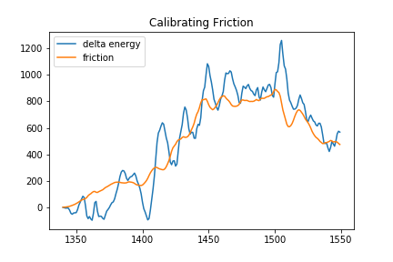
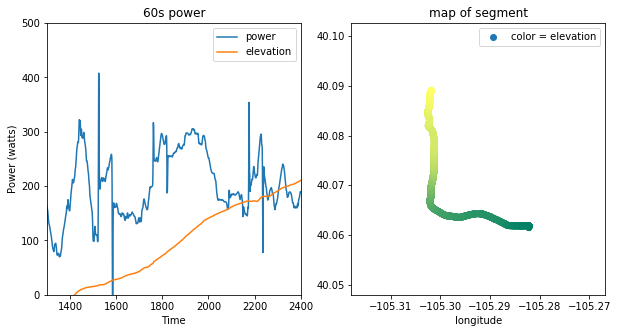
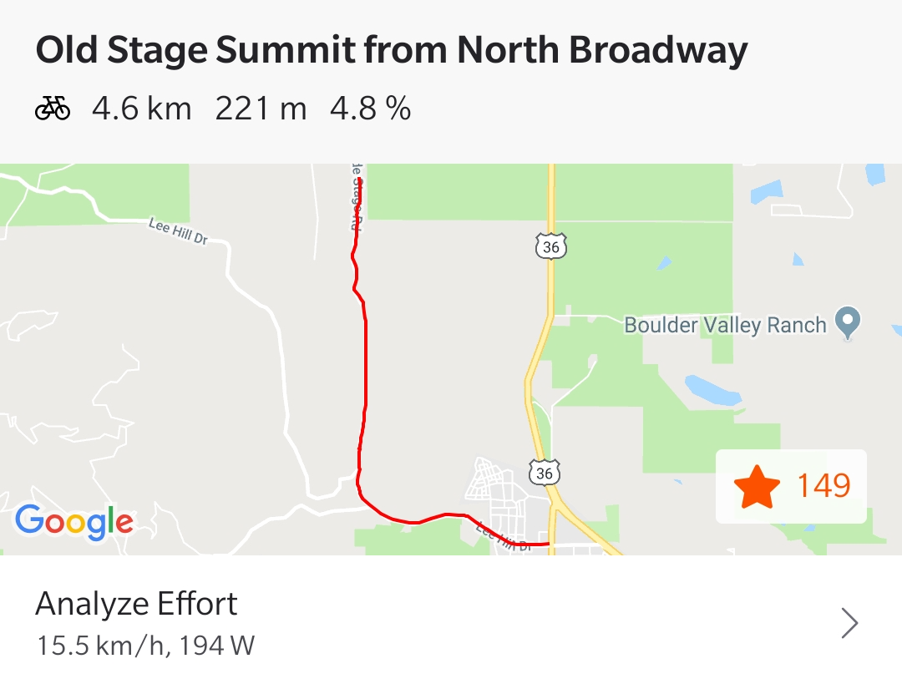
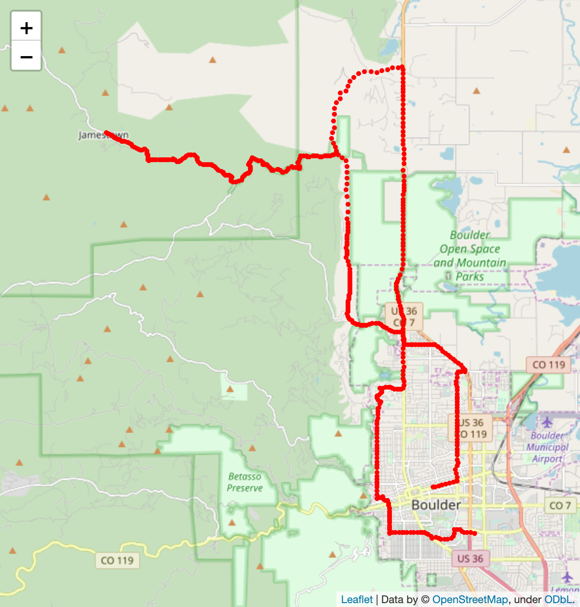

# Cycling Power Calculator

## Abstract

When you are on a road bike, there is very little between you and the power going through the pavement. Simple physics equations dictate how fast you will roll. Using only GPS data recorded during a ride, power output and calories burned can be calculated.

## The Model

A rider has some internal energy due to gravity and the velocity they travel. This should remain constant unless other forces do work on the system. The rider pushing on the pedals propels the bike forward while aerodynamic drag and rolling resistance drain the system of energy. By estimating the drag forces, ride power output can be calculated

## Calibrating Friction

To test the coefficient of friction for air resistance, I rode down a hill without pedaling or braking. Additionally, wind was recorded to be < 10km/h. Thus my power should 0 watts and any change in energy is due to friction. The graph below compares the calculated $\Delta$ energy to the estimated power due to friction where the coefficient of air resistance and rolling resistance is 0.42 and 0.0008 respectively.

These values agree with data from [Cycling Power Labs](https://www.cyclingpowerlab.com/CyclingAerodynamics.aspx)  that suggests the CdA = 0.4 while riding on the hoods.

There are some other factors to account for. I conducted this test riding on the hoods, a more upright and un-aerodynamic position. This position can account for most riding, however at high speeds riders will ride in the drops, minimizing their frontal area and becoming more aerodynamic. A more clever model would adjust the coefficient of friction when a rider is likely riding in a more aerodynamic position.

However, the true test of power is on the climbs where air resistance is less significant.

## Segment Analysis: Old Stage Road

This yeilded an average power of 203.4 watts. This closely agrees with calculations by Strava with < 5% error.

### Strava Power

## Full Ride

## Training Tools

Determining how much time a rider has spent in each power zone can aid training planning and efficiency.

## Calories burned

Over the entire ride, my average power output was 125 Watts.

Watts * seconds = joules

Joules / 4184 = Kcal

Additionally we can assume the human body is 25% efficient when converting energy to power.

Therefore I burned 1138 Kcal on this ride.
