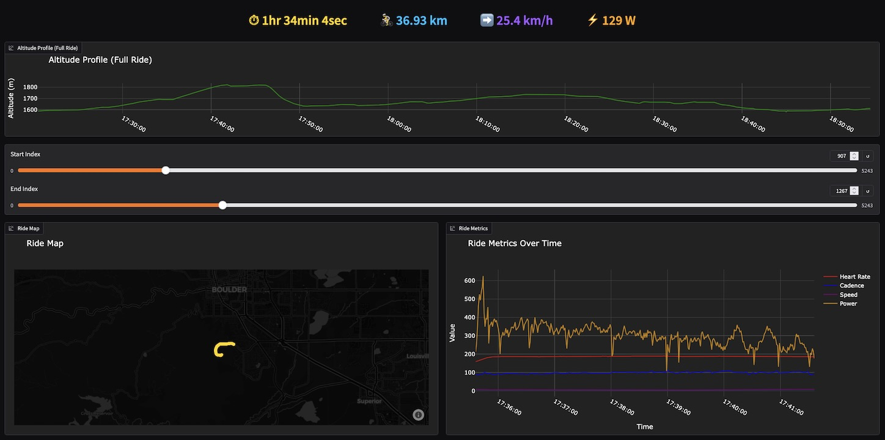
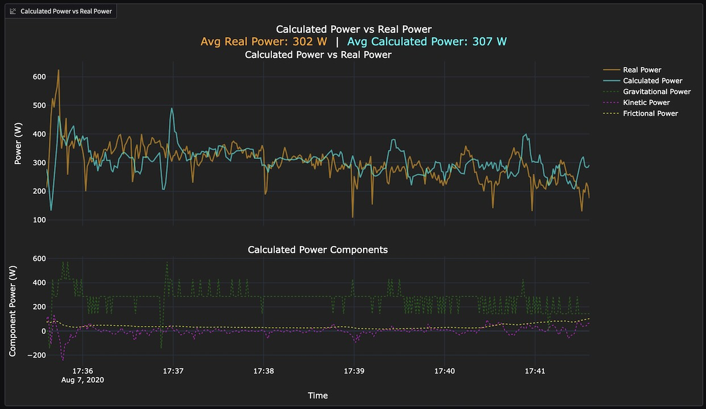

# Cycling Power Calculator



Cycling Power Calculator is an interactive application for analyzing cycling ride data from `.fit` and `.gpx` files. It allows you to visualize ride metrics, map your route, and estimate your cycling power output using a physics-based model. The app is built with [Gradio](https://gradio.app/) and [Plotly](https://plotly.com/python/), and is intended for cyclists, coaches, and enthusiasts who want to explore and compare real and calculated power data.




## Notice

Values for important physical constants like air density and drag coefficients are mostly chosen arbitrarily. The accuracy of the physics model may suffer under certain conditions.

This app was developed using a personal fit file. Assumptions about data field existence, units, and sample rate are engrained into the code. Your ride data may vary and the app may not work as expected. If you encounter issues, please open an issue on GitHub.

## Features

- Upload and analyze `.fit` and `.gpx` ride files
- Visualize ride metrics (heart rate, cadence, speed, power, altitude) over time
- Interactive ride map plotting GPS data
- Histograms for power and heart rate distributions
- Physics-based power estimation using customizable rider and bike parameters
- Compare real (measured) and calculated (estimated) power output

## Installation

1. **Clone the repository:**
   ```bash
   git clone https://github.com/royceschultz/Cycling-Power-Calculator.git
   cd Cycling-Power-Calculator
   ```

2. **Install Python dependencies:**
   Ensure python is installed on your system. This app was developed using Python 3.12.9.
   ```bash
   pip install -r requirements.txt
   ```

## Usage

1. **Run the Gradio app:**
   ```bash
   python gradio_app.py
   ```
   Alternatively, gradio supports hot reloading (great for development) with this command:
    ```bash
    gradio app gradio_app.py
    ```
   This will start a local web server and provide a link in your terminal (e.g., `http://127.0.0.1:7860/`).

2. **Using the App:**
   - Upload your `.fit` or `.gpx` ride file, or select one from the `rides` folder.
   - Explore your ride data with interactive plots and maps.
   - Use the "Calculate Estimated Power" section to estimate your power output based on rider/bike parameters and compare it to your real power data.

## Project Structure

- `gradio_app.py` - Main Gradio app interface
- `utils/` - Helper modules for loading rides, calculating metrics, and power estimation
- `gradio_components.py` - Plotly graph generation functions
- `requirements.txt` - Python dependencies

---

Details about previous iterations of this project can be found in [README.old.md](./README.old.md).


## Future Development
- GPX loading is not implemented
- Define more accurate and customizable physical coefficients


