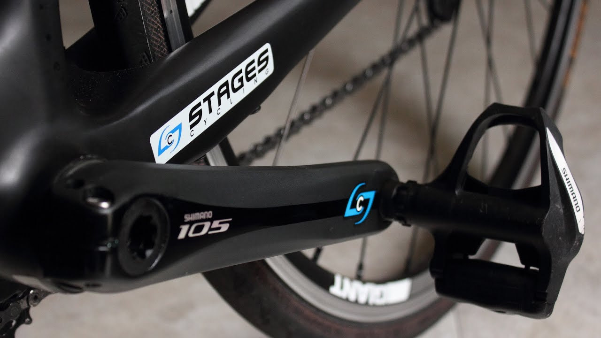

# Cycling Power Calculator

## 2020 Update

I recently got a power meter so I can now verify my calculations with a calibrated baseline.

## Abstract

Using recorded GPS data from my bike ride and the laws of motion, we can calculate the power output of the rider. Power output is a useful metric to measure training load and fitness.

## The Model

The Golden Rule: Energy in a closed system is always conserved.

First, calculate the total internal energy: Gravitational energy which depends on altitude, and kinetic energy which depends on speed.

Then, using numerical method, calculate the derivative of the total energy. This is the net power output; Power after frictional forces have been applied. We are more interested in the real power output of the rider exerted on the pedals. There are frictional forces in the chain and drivetrain, between the tires and the road, and between the rider and the wind. We must model the power lost due to friction to estimate real power.

### Derivative Calculation

**Forward Euler's Method**

TODO

**First Order Method**

TODO

**4th Order Method**

TODO

### Frictional Power Estimation

Power = Joules / second = Force * Distance / Time = Force * Velocity

**Drivetrain friction** is generally very small and can be ignored. Manufacturers selling [expensive chains](https://www.ceramicspeed.com/en/cycling/shop/ufo-products/ufo-racing-chain-shimano-11s/) with special coatings only claim a 2-5 watt improvement.

The force of **rolling resistance** is proportional to mass. Then simply multiply by velocity (meters/second) to get power.

The force due to **air resistance** is well understood.

F = .5 * density of air * velocity**2 * coeficcient of drag * frontal area

Then, like rolling resistance, multiply by velocity to calculate power.
The density of air depends on your location and temperature. This ride in Boulder is at altitude (over a mile high) and on a warm summer day (over 30°C 🔥🥵), so the density and thus energy lost to air resistance is lower than a ride at sea-level.

Rolling resistance is proportional to velocity, while air resistance is dependent on velocity^3. Clearly air resistance becomes the dominant force at high speeds.

## Calibrating Friction with a Powermeter

A powermeter is an electronic tool in the pedal crank. It measures the force on the crank and uses the rotation speed to calculate real power output (watts). This data stream is also recorded during the ride alongside GPS data.
I use a [stages powermeter](https://store.stagescycling.com/stages-power-meters) (not sponsored).

We can simply plot the calculated power against the recorded power. Here is my power up NCAR, a short local climb.

My calculated power is accurate to 3%. Most powermeters only claim accuracy to +/- 1.5%.

Here's another segment in Boulder. Flagstaff is a bit longer and steeper.

These results were less accurate with 11% error. I may need to go back and tune the variables affecting friction. Because it's a longer ride, I was riding in a more comfortable, upright position which increases my coefficient of drag and frontal area.

## Calibrating Friction (Pre-Powermeter)

To test the coefficient of friction for air resistance, I rode down a hill without pedaling or braking. Additionally, wind was recorded to be < 10km/h. Thus my power should 0 watts and any change in energy is due to friction. The graph below compares the calculated change in energy to the estimated power due to friction where the coefficient of air resistance and rolling resistance is 0.42 and 0.0008 respectively.

Because the values are approximately equal, the estimated power output is approximately 0. The true test of power is on the hills where frictional forces are smaller than in this test. Even sill, the coefficient of air resistance agree with data from [Cycling Power Labs](https://www.cyclingpowerlab.com/CyclingAerodynamics.aspx)  that suggests the CdA = 0.4.

## Segment Analysis (Pre-Powermeter): Old Stage Road

This yeilded an average power of 203.4 watts. This closely agrees with calculations by Strava with < 5% error.

## Training Tools

Determining how much time a rider has spent in each power zone can aid training planning and efficiency.

