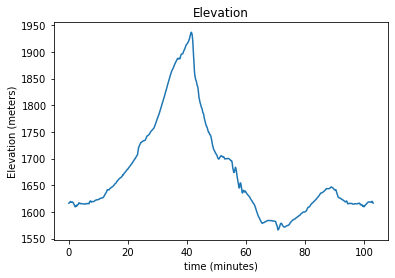
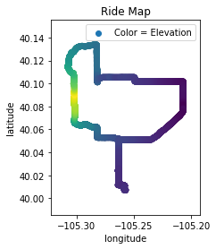
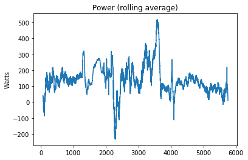
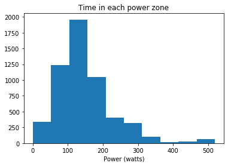
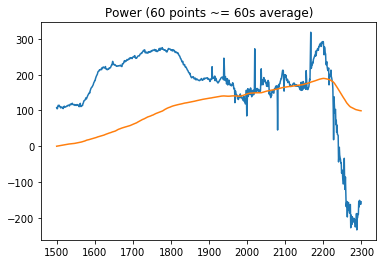

# Cycling Power Calculator

## Abstract

When you are on a road bike, there is very little between you and the power going through the pavement. Simple physics equations dictate how fast you will roll. Using only GPS data recorded during a ride, power output and calories burned can be calculated.

## The Model

A rider has some internal energy due to gravity and the velocity they travel. This should remain constant unless other forces do work on the system. The rider pushing on the pedals propels the bike forward while aerodynamic drag and rolling resistance drain the system of energy. By estimating the drag forces, ride power output can be calculated

## Ride Info

## Power Output

Negative power is braking.

## Training Tools

Determining how much time a rider has spent in each power zone can aid training planning and efficiency.

## Segment Analysis: Old Stage Road

